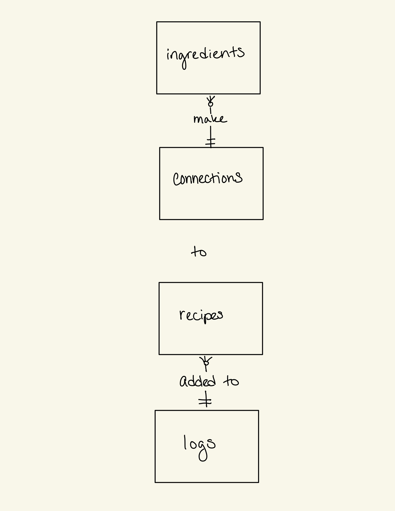

# Design Document

By Ashley Griffin

Video overview: <https://www.youtube.com/watch?v=EWhxP_MC0Mk>

## Scope

This database is used to organize recipes, plan meals, and create organized grocery lists. The purpose of this database is to decrease the time and brain power spent on deciding what to eat and what you need in order to make it. It includes a list of all possible ingredients and a list of recipes. This system can be useful to anyone who cooks for themselves and/or their family.

Other items you may purchase at the grocery store, such as paper goods or cleaning supplies, are outside of the scope of this database.

## Functional Requirements

With this database, a user should be able to:
* Add recipes
* Add ingredients that correspond to those recipes
* Create a meal plan for the week ahead of making a trip to the grocery store
* Pull a list of out-of-stock ingredients that need to be purchased in order to make a given meal
* Pull a list of all ingredients needed for a given meal, regardless of availability
* Calculate the total cost for a meal
* Choose a meal at random (i.e. when you can't decide what to make for a meal)
* List all recipes of a certain type/origin

## Representation

The database contains the following entities:

### Entities

#### Ingredients
The Ingredients table includes:
* id - INTEGER - the primary key 'id' automatically increments
* name - TEXT NOT NULL - what the ingredients is called
* category - TEXT NOT NULL -
* section - TEXT NOT NULL - where the item would be found in the grocery store
* in-stock - TEXT NOT NULL - this yes/no column describes the availability of the product
* price - NUMERIC - the cost per serving of an ingredient; it is categorized as numeric and not as an integer to allow decimal places

#### Recipes
The Recipes table includes:
* id - INTEGER - the primary key 'id' automatically increments
* name - TEXT NOT NULL - what the recipe is called
* cook time - INTEGER NOT NULL - how long it takes to prepare the dish
* meal type - TEXT NOT NULL - breakfast/lunch/dinner/snack
* cuisine type/region or origin - TEXT NOT NULL - the culture from which the dish originated, if applicable

#### Connections
The Connections table includes:
* id - INTEGER - the primary key 'id' automatically increments
* ingredient id - foreign key references the id listed in Ingredients table for desired item
* recipe id - foreign key references the id listed in Recipes table for desired dish

#### Logs
The Logs table includes:

* id - INTEGER - the primary key 'id' automatically increments
* date - DATE - the date format is YYYY-MM-DD
* recipe id - foreign key references the id listed in Recipes table for desired dish

I chose these tables and columns in order to cleanly store the data and manipulate it effectively.

### Relationships

* One ingredient can have zero or many connections (to recipes). Each connection has one and only one ingredient.
* Each connection has one and only one recipe. One recipe can have zero or many connections (to ingredients).
* Each recipe can be in zero or many logs (weekly meal plans). Each log entry has one recipe in it.

## Optimizations

I created a view called "List" to have quick access to the out-of-stock ingredients (and their locations in a grocery store) needed for all of the recipes in this week's meal plan. I chose to make this view because it is anticipated to be one of the most used actions with this database.

## Limitations

The list view should be able to pull log entries with a range of dates (i.e., if you're making a grocery trip on 4/1, you should be able to include entries made on 3/31, too.)

The prices of each ingredient don't take into consideration weekly sales.
